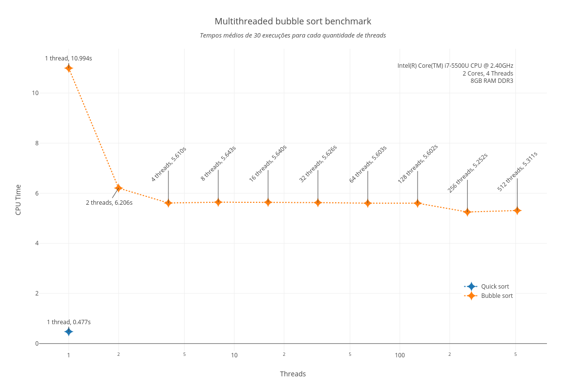

# Comparação de algoritmos de ordenação

## Bubble sort multithreaded

Algoritmo de ordenação [bubble sort](https://pt.wikipedia.org/wiki/Bubble_sort) executado sobre 1000 vetores de 1000 elementos aleatórios cada. Código original do experimento disponível em `results/20180323200947/code`.

### Resultados do _benchmark_

[Valores brutos (CSV)](results/20180323200947/benchmark_results.csv).

Valores em gráfico:

